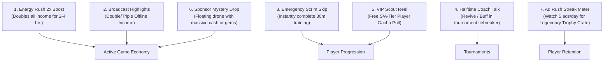

# Game Design Document (GDD): Esports Dynasty: Idle Manager

> Target design. See [implementation status](PROJECT_STATUS.md) for current behavior and unresolved balancing differences.

**Project Working Title:** Esports Dynasty: Idle Manager  
**Platform:** Mobile (Android & iOS via Capacitor / Web PWA)  
**Genre:** Idle / Incremental Tycoon Simulation  
**Core Monetization Focus:** Rewarded Video Ad-Accelerated Progression Loop  
**Target Audience:** Fans of idle/clicker games (*AdVenture Capitalist*, *Idle Miner Tycoon*, *Eatventure*), mobile esports enthusiasts, management sim players.

---

## 1. Executive Summary & Core Fantasy

### 1.1 The Fantasy
The player steps into the shoes of an ambitious CEO of a fledgling esports organization operating out of a cramped basement. By scouting raw gaming talents, upgrading gaming setups, entering grassroots tournaments, and signing lucrative sponsorships, the player scales their organization into a world-dominating multi-gaming conglomerate with luxurious team houses, world championship trophies, and a global fanbase.

### 1.2 The Core Monetization Hook (Ad-Driven Acceleration)
Rather than blocking players with hard paywalls or interrupting them with intrusive interstitial popups, progression in *Esports Dynasty* is purposefully balanced around **high-value, opt-in Rewarded Ads**.
- Standard idle progression provides a satisfying baseline trickle.
- **Rewarded ads act as explosive catalyst triggers** (e.g., "Sponsor Energy Surge: 2x speed for 4 hours", "3x Offline Streaming Prize Multiplier", "Halftime Coach Speech Clutch Revive", "VIP Scout Reel").
- Players *want* to watch ads because every ad viewed delivers an immediate, visible dopamine rush of progress, skipping grinding friction or doubling hard-earned tournament prize pools.

---

## 2. Core Currencies & Economy

| Currency | Icon | Source | Primary Use |
| :--- | :--- | :--- | :--- |
| **Cash ($)** | 💵 | Scrims, live streams, sponsors, passive ticket sales, tournament prizes | Buying gear, paying player contracts, leveling up facility rooms |
| **Hype / Fans** | 🔥 | Winning tournaments, viral social media posts, streaming milestones | Serves as a global percentage multiplier to passive revenue |
| **Energy Cans (Gems)** | ⚡ / 💎 | Daily logins, achievements, Rewarded Ad Crates, milestone wins | Premium currency for instant skips, elite scouting rolls, permanent boosts |
| **Legacy Trophies** | 🏆 | Rebranding / Franchising (Prestige Reset at season end) | Upgrading the permanent "Hall of Fame" tech tree |

### 2.1 Idle Formula & Scaling
* **Upgrade Cost Curve:**  
  $$Cost_n = BaseCost \times (1.15)^n$$
* **Income Rate Curve:**  
  $$Income_n = BaseIncome \times Level \times Multipliers_{Facilities} \times Multipliers_{Hype} \times Multipliers_{Ads}$$
* **Offline Earnings:**  
  Calculated on app resume:  
  $$\Delta t = \min(CurrentTime - LastSaveTime, MaxOfflineDuration)$$  
  $$OfflineCash = \Delta t \times IncomePerSecond$$  
  *Ad Hook:* Double or Triple offline earnings on resume.

---

## 3. Game Loops

### 3.1 The Micro-Loop (Seconds to 2 Minutes)
1. **Tap / Generate:** Tap the "Bootcamp Scrim" desk or collect generated stream tips from pro players.
2. **Instant Upgrades:** Spend accumulated cash on hardware upgrades (High-Refresh Monitors, Mechanical Keyboards, Ergonomic Gaming Chairs).
3. **Random Pop-Up Events:** A floating "Energy Drink Drone" or "Sponsor Call" pops up on screen offering an instant 30-second Rewarded Ad for a huge cash windfall or 30s frenzy.

### 3.2 The Macro-Loop (Minutes to Hours)
1. **Roster Management:** Train pro players across 4 core attributes:
   - **Aim / Mechanics** (raw kill potential)
   - **Game Sense / Macro** (objective control)
   - **Communication** (team synergy)
   - **Mental / Tilt Resistance** (performance under pressure)
2. **Facility Expansion:** Unlock and upgrade specialized rooms in the Team Gaming House:
   - *PC Scrim Lab* (increases base cash & training speed)
   - *Streaming Pods* (generates passive cash & fans per second)
   - *Fitness & Nutrition Gym* (reduces player fatigue, boosts tournament endurance)
   - *Analyst Room* (boosts tournament counter-strategy multipliers)
   - *Merchandise Workshop* (generates high-margin passive merchandise sales)
3. **Tournament Circuit:** Register team for tiered leagues:
   - Grassroots Cup $\rightarrow$ Challenger Series $\rightarrow$ Continental Masters $\rightarrow$ World Invitational.
   - Auto-simulated matches with a tactical coach card or buff selection.

### 3.3 The Meta / Prestige Loop (Days to Weeks)
1. **Season Rebrand (Prestige):** When progress slows at higher tournament tiers, sell or rebrand the organization franchise.
2. **Legacy Trophies:** Earn Legacy Trophies based on lifetime Cash and Fan count.
3. **Hall of Fame Perks:** Permanent upgrades:
   - Permanent +50% Ad Duration (e.g., 2x boost lasts 6h instead of 4h)
   - Permanent +10% base scouting chance for S-Tier players
   - Unlock new Esports Titles (Tactical FPS $\rightarrow$ 5v5 MOBA $\rightarrow$ Battle Royale).

---

## 4. The 7 Rewarded Ad Acceleration Pillars

Every ad placement is contextualized within the esports organizational theme:

### Detail of Placements:
1. **The "Energy Rush" Global Multiplier:**
   - **Trigger:** Top header HUD button showing a battery or energy drink can.
   - **Reward:** $2\times$ cash and training speed for 2 hours (can stack up to 8 hours by watching multiple ads).
   - **Retention Impact:** High daily session trigger.
2. **"Post-Match Broadcast" Offline Multiplier:**
   - **Trigger:** On returning to the game after $>10$ minutes idle.
   - **Reward:** Collect $1\times$ for free, or watch 1 ad to collect $3\times$ total earnings.
3. **"Tactical Halftime Speech" (Tournament Clutch Buff):**
   - **Trigger:** If your team loses a match in a best-of-3 tournament series.
   - **Reward:** Instant +25% team morale and stat surge for Game 3 rematch. Eliminates loss penalty.
4. **"Scouting Highlight Reel" (Ad Gacha):**
   - **Trigger:** Scouting Agency tab.
   - **Reward:** 1 free Premium Scout Roll every 2 hours via rewarded video (gives chance at Gold/Diamond tier players).
5. **"Speed Bootcamp" Time Skip:**
   - **Trigger:** Upgrading high-level facilities or running extensive training modules that have a countdown timer.
   - **Reward:** Instant 30-minute to 1-hour time deduction.
6. **"Sponsor Activation Mystery Drone":**
   - **Trigger:** Every 4-7 minutes, a sponsored drone flies across the team house.
   - **Reward:** Tapping opens a sponsor offer: "Watch short sponsor clip to receive 15 minutes of instant revenue or 10 Energy Cans".
7. **"Daily Ad Sponsor Pass" (Streak Milestone):**
   - **Trigger:** Dedicated "Sponsor Quests" tab.
   - **Reward:** A progression bar from 1 to 5 daily ads watched. Completing 5 ad watches awards a "Championship Gold Crate".

---

## 5. Esports Thematic Elements

### 5.1 Game Disciplines
- **Tactical Shooter (e.g., "StrikePoint"):** Relies on Aim + Comms.
- **MOBA (e.g., "Clash of Ancients"):** Relies on Game Sense + Strategy.
- **Battle Royale (e.g., "DropZone"):** Relies on Reflexes + Positioning.

### 5.2 Roster Archetypes
- **The Young Prodigy:** High aim growth, low tilt resistance (tilts easily unless coached).
- **The Veteran IGL (In-Game Leader):** High game sense and communication, slower mechanics, provides team-wide stat buffs.
- **The Content Creator Pro:** Generates massive streaming hype and merch cash, moderate competitive stats.
- **The Import Superstar:** High overall stats, requires larger salary and upgraded gaming house amenities.

---

## 6. Success Metrics & KPIs
- **Ad Engagement Rate:** Target $\ge 80\%$ of Daily Active Users (DAU) engaging with at least 3 rewarded ads per day.
- **Average Impressions Per DAU (IMP/DAU):** Target 6–10 rewarded ad views per active player daily.
- **D1 / D7 / D30 Retention:** Target D1 $\ge 45\%$, D7 $\ge 18\%$, D30 $\ge 8\%$.
- **Session Duration:** 3–5 sessions daily, averaging 4–6 minutes per session (ideal for micro-idle pacing).
